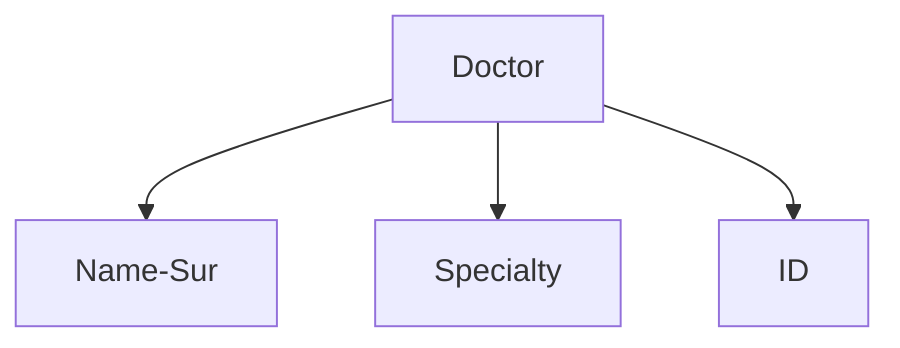
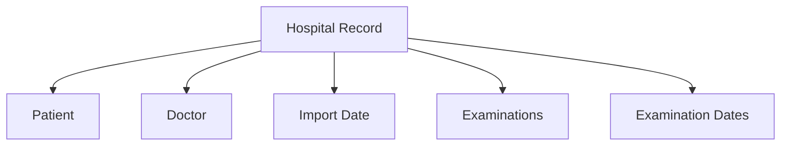
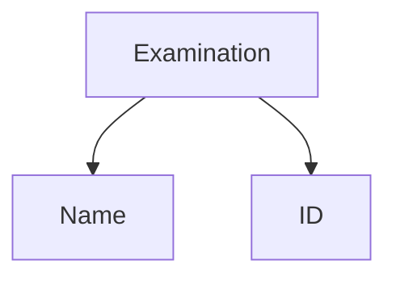

# SimpleJava/ClassDesign
> A simple Java program for managing classes
 
 ## Table of contents
* [Features](#features)
* [Setup](#setup)

 

 
 ## Features
 1. Enter hospital details 
 2. Exam introduction.
 3. Doctor introduction.
 4. Patient admission.
 5. Insertion of a patient's file.
 6. Deletion of a patient based on the AMKA.
 7. Search medical records and printing their details
    * By patient's AMKA
    * By Hospital and Dates
 8. Print the details of all examinations, or doctors, or patients, or files.

## Hierarchy

*
 ```mermaid
graph TD;
    A[Hospital]-->B[Name];
    A[Hospital]-->C[Departs];

```
*
 ```mermaid
graph TD;
    A[Doctor]-->B[Name-Sur];
    A[Doctor]-->C[Specialty];
    A[Doctor]-->D[ID];

```
*

*

*


 
 ## Setup
Java IDE environment (Eclipse implemented)

* Import project to eclipse workshop
* Run as Java application


